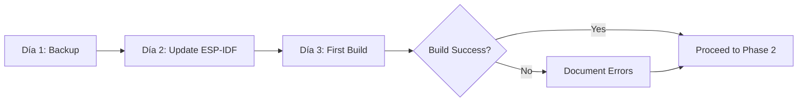
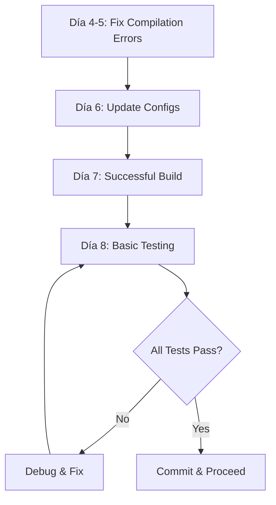
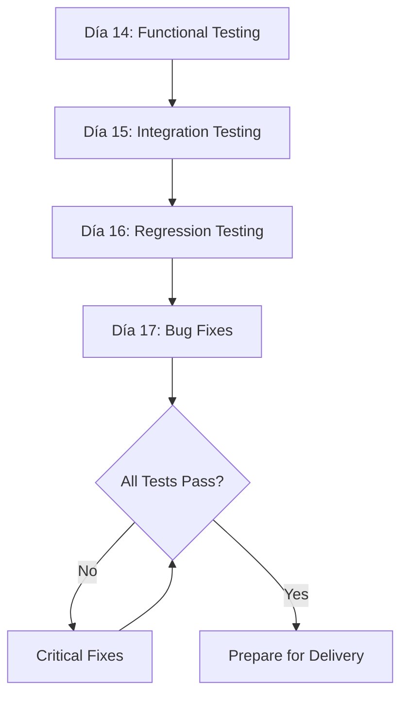

# 🗺️ Roadmap Visual de Implementación - Migración ESP-IDF v5.4

## 📅 Timeline Overview (15-18 días laborables)

```
Semana 1: Preparación y Migración Core
├─ Días 1-3:  Preparación y Setup (3 días)
└─ Días 4-8:  Migración Core (5 días)

Semana 2: Mejoras y Testing
├─ Días 9-13: Mejoras Arquitecturales (5 días)
└─ Días 14-17: Testing y Validación (4 días)

Semana 3: Documentación y Entrega
└─ Días 18-19: Documentación y Entrega (2 días)
```

---

## 📊 Diagrama de Gantt

```
Fase                  | Día 1 | 2 | 3 | 4 | 5 | 6 | 7 | 8 | 9 | 10| 11| 12| 13| 14| 15| 16| 17| 18| 19|
=====================|=======|===|===|===|===|===|===|===|===|===|===|===|===|===|===|===|===|===|===|
Fase 1: Preparación   |███████████████|   |   |   |   |   |   |   |   |   |   |   |   |   |   |   |   |
Fase 2: Migración Core|   |   |   |███████████████████████████████|   |   |   |   |   |   |   |   |   |
Fase 3: Mejoras       |   |   |   |   |   |   |   |   |███████████████████████████████|   |   |   |   |
Fase 4: Testing       |   |   |   |   |   |   |   |   |   |   |   |   |   |███████████████████████|   |
Fase 5: Documentación |   |   |   |   |   |   |   |   |   |   |   |   |   |   |   |   |   |███████████|

Hitos (◆):            |   |   | ◆ |   |   |   |   | ◆ |   |   |   |   | ◆ |   |   |   | ◆ |   | ◆ |
                       Setup Build   Tasks   Mem    Tests  Docs
```

**Hitos Críticos:**
- 🎯 **Día 3**: Entorno preparado, primera compilación intentada
- 🎯 **Día 8**: Primera compilación exitosa + boot test
- 🎯 **Día 13**: Todas las mejoras arquitecturales implementadas
- 🎯 **Día 17**: Testing completo finalizado
- 🎯 **Día 19**: Documentación completa + entrega

---

## 🔄 Flujo de Trabajo Detallado

### Fase 1: Preparación y Setup (Días 1-3)



**Entregables:**
- ✅ Branch `migration/esp-idf-v5.4` creado
- ✅ Tag `v5.3.2-baseline` creado
- ✅ ESP-IDF v5.4.x instalado
- ✅ `MIGRATION_ERRORS.md` con todos los errores documentados

---

### Fase 2: Migración Core (Días 4-8)



**Componentes a Migrar (en orden):**
1. **Core System** (main.c, preferences, flash_fs)
2. **WiFi Subsystem** (wifi_controller, wifi_scanner, wifi_attacks)
3. **Bluetooth Subsystem** (ble_hid, ble_scann, bt_gattc, bt_gatts)
4. **Zigbee Subsystem** (zb_cli, zigbee_switch, esp-zigbee-console)
5. **Thread Subsystem** (openthread, open_thread, thread_broadcast)
6. **GPS Subsystem** (nmea_parser, gps_module, wardriving)
7. **UI Subsystem** (oled_screen, menus_module, keyboard)
8. **Peripherals** (sd_card, buzzer, leds, uart_bridge)

**Checklist por Componente:**
```
[ ] WiFi Subsystem
    [ ] Compila sin errores
    [ ] WiFi scan funciona
    [ ] WiFi connect funciona
    [ ] APIs actualizadas

[ ] Bluetooth Subsystem
    [ ] Compila sin errores
    [ ] BLE scan funciona
    [ ] HID device funciona
    [ ] APIs actualizadas

[ ] Zigbee Subsystem
    [ ] Compila sin errores
    [ ] CLI funciona
    [ ] Switch funciona
    [ ] Managed components actualizados

[ ] Thread Subsystem
    [ ] Compila sin errores
    [ ] OpenThread inicia
    [ ] Broadcast funciona
    [ ] APIs actualizadas

[ ] GPS Subsystem
    [ ] Compila sin errores
    [ ] NMEA parsing funciona
    [ ] Wardriving funciona
    [ ] Multi-constellation OK

[ ] UI Subsystem
    [ ] Compila sin errores
    [ ] OLED display funciona
    [ ] Menús navegables
    [ ] Keyboard responsive

[ ] Peripherals
    [ ] SD card mount funciona
    [ ] Buzzer funciona
    [ ] LEDs funcionan
    [ ] UART bridge funciona
```

---

### Fase 3: Mejoras Arquitecturales (Días 9-13)


**Implementación Progresiva:**

#### Día 9: Task Manager
```c
// Crear estructura
main/core/task_manager/
├── task_manager.c
├── task_manager.h
└── CMakeLists.txt

// Implementar funcionalidades
- task_manager_init()
- task_manager_create()
- task_manager_delete()
- task_manager_list_all()
- task_manager_get_info()

// Unit test
- test_task_manager.c
```

#### Día 10: Migración de Tareas
**Orden de migración:**
1. ✅ **Sistema crítico** (1-2 tareas)
   - `main.c` → Validar que funciona
2. ✅ **WiFi tasks** (5-8 tareas)
   - `wifi_attacks.c`, `captive_module.c`, etc.
3. ✅ **BLE tasks** (3-5 tareas)
   - `gattcmd`, `ble_scann`, etc.
4. ✅ **Zigbee/Thread tasks** (8-12 tareas)
   - `zigbee_switch.c`, `open_thread.c`, etc.
5. ✅ **GPS tasks** (3-4 tareas)
   - Wardriving modules
6. ✅ **UI/Misc tasks** (5-8 tareas)
   - Animations, LEDs, screen saver

**Patrón de migración:**
```c
// ANTES:
xTaskCreate(my_task_func, "my_task", 4096, NULL, 5, &my_handle);

// DESPUÉS:
task_manager_create(
    my_task_func,
    "protocol_mytask",  // Naming convention: <module>_<function>
    TASK_STACK_MEDIUM,  // Enum estandarizado
    NULL,
    TASK_PRIORITY_NORMAL,  // Enum estandarizado
    &my_handle
);
```

#### Día 11: Memory Manager
```c
// Implementar
- mem_pool_init()
- mem_pool_alloc()
- mem_pool_free()
- heap_monitor_start()
- heap_monitor_get_stats()

// Configurar pools
POOL_WIFI_SCAN_RESULT: 50 objetos
POOL_GPS_COORDINATE: 100 objetos
POOL_BLE_ADV_DATA: 30 objetos

// Testing
- Memory stress test
- Leak detection test
```

#### Día 12: Error Handler
```c
// Implementar
- error_handler_init()
- error_handler_report()
- error_handler_set_restart_callback()
- structured_log_event()

// Migrar componentes críticos
- wifi_controller
- zigbee_switch
- gps_module
```

#### Día 13: Power Management
```c
// Optimizar sdkconfig
- Review power settings
- Enable DFS if applicable
- Configure sleep modes

// Testing
- Current measurement
- Battery life estimation
```

---

### Fase 4: Testing y Validación (Días 14-17)



#### Testing Matrix

| Feature | Day 14 | Day 15 | Day 16 | Notes |
|---------|--------|--------|--------|-------|
| **WiFi Scan** | ✅ | ✅ | ✅ | Basic + Stress + Regression |
| **WiFi Attacks** | ✅ | ❌ | ✅ | Basic + Regression |
| **BLE Scan** | ✅ | ✅ | ✅ | Basic + Stress + Regression |
| **BLE HID** | ✅ | ❌ | ✅ | Basic + Regression |
| **Zigbee CLI** | ✅ | ✅ | ✅ | Basic + Integration + Regression |
| **Thread Sniffer** | ✅ | ✅ | ✅ | Basic + Integration + Regression |
| **GPS Parsing** | ✅ | ❌ | ✅ | Basic + Regression |
| **Wardriving** | ✅ | ✅ | ✅ | Basic + Integration + Regression |
| **WiFi+BLE Coex** | ❌ | ✅ | ✅ | Integration + Regression |
| **Zigbee+Thread** | ❌ | ✅ | ✅ | Integration + Regression |
| **Memory Stress** | ❌ | ✅ | ✅ | 24h test |
| **Reboot Cycles** | ❌ | ❌ | ✅ | 100 cycles |

#### Test Automation Script

```bash
#!/bin/bash
# test_suite.sh - Automated testing script

DEVICE_PORT="/dev/ttyUSB0"
LOG_DIR="./test_logs"
mkdir -p "$LOG_DIR"

# Function: Run test and log results
run_test() {
    local test_name=$1
    local test_command=$2
    echo "Running test: $test_name"
    
    idf.py -p "$DEVICE_PORT" monitor <<EOF > "$LOG_DIR/${test_name}.log" 2>&1
$test_command
EOF
    
    if grep -q "TEST PASSED" "$LOG_DIR/${test_name}.log"; then
        echo "✅ $test_name PASSED"
        return 0
    else
        echo "❌ $test_name FAILED"
        return 1
    fi
}

# Day 14: Functional Tests
echo "=== Day 14: Functional Testing ==="
run_test "wifi_scan" "wifi scan"
run_test "ble_scan" "ble scan"
run_test "gps_test" "gps info"
# ... más tests

# Day 15: Integration Tests
echo "=== Day 15: Integration Testing ==="
run_test "wifi_ble_coex" "coex wifi_ble"
# ... más tests

# Day 16: Regression Tests
echo "=== Day 16: Regression Testing ==="
# Ejecutar todos los tests de nuevo
# ... 

# Generate test report
generate_report() {
    echo "# Test Report" > "$LOG_DIR/REPORT.md"
    echo "Date: $(date)" >> "$LOG_DIR/REPORT.md"
    echo "" >> "$LOG_DIR/REPORT.md"
    
    for log in "$LOG_DIR"/*.log; do
        test_name=$(basename "$log" .log)
        if grep -q "TEST PASSED" "$log"; then
            echo "- ✅ $test_name: PASSED" >> "$LOG_DIR/REPORT.md"
        else
            echo "- ❌ $test_name: FAILED" >> "$LOG_DIR/REPORT.md"
        fi
    done
}

generate_report
```

---

### Fase 5: Documentación y Entrega (Días 18-19)


#### Documentos a Crear/Actualizar

| Documento | Día | Estado | Notas |
|-----------|-----|--------|-------|
| `README.md` | 18 | 📝 | Actualizar versión ESP-IDF, requisitos |
| `CHANGELOG.md` | 18 | ✅ | Listar todos los cambios |
| `ARCHITECTURE.md` | 18 | ✅ | Documentar nueva arquitectura |
| `TROUBLESHOOTING.md` | 18 | ✅ | Problemas comunes + soluciones |
| `API_REFERENCE.md` | 18 | ✅ | APIs nuevas (task_manager, etc.) |
| `MIGRATION_REPORT.md` | 19 | ✅ | Reporte final de migración |
| `TEST_REPORT.md` | 19 | ✅ | Resultados de todos los tests |

---

## 📈 Métricas de Éxito

### KPIs por Fase

#### Fase 1: Preparación
- [ ] **100%** de funcionalidades documentadas
- [ ] **0** errores de setup (ESP-IDF instalado correctamente)

#### Fase 2: Migración Core
- [ ] **100%** de código compila sin errores
- [ ] **< 20** warnings críticos
- [ ] **100%** de funcionalidades básicas funcionan

#### Fase 3: Mejoras
- [ ] **> 80%** de tareas migradas a task_manager
- [ ] **> 50%** reducción en `malloc/free` (gracias a pools)
- [ ] **100%** de errores críticos con recovery

#### Fase 4: Testing
- [ ] **100%** de tests funcionales pasan
- [ ] **100%** de tests de integración pasan
- [ ] **0** regresiones detectadas
- [ ] **24h** stress test sin crashes

#### Fase 5: Documentación
- [ ] **100%** de documentación requerida completada
- [ ] **100%** de APIs públicas documentadas
- [ ] **1** handoff meeting exitosa

---

## ⚠️ Puntos de Control (Checkpoints)

### Checkpoint 1: Fin de Fase 1 (Día 3)
**Criterios:**
- ✅ ESP-IDF v5.4.x instalado y verificado
- ✅ Primera compilación intentada
- ✅ Errores documentados

**Decisión:**
- Si > 100 errores → Considerar estrategia de migración incremental más lenta
- Si < 50 errores → Proceder con confianza a Fase 2

### Checkpoint 2: Fin de Fase 2 (Día 8)
**Criterios:**
- ✅ Compilación exitosa
- ✅ Device bootea correctamente
- ✅ WiFi y BLE básico funcionan

**Decisión:**
- Si fallan tests básicos → Extender Fase 2 (2-3 días más)
- Si todo OK → Proceder a Fase 3

### Checkpoint 3: Fin de Fase 3 (Día 13)
**Criterios:**
- ✅ Task Manager implementado y funcionando
- ✅ Memory Manager funcionando
- ✅ Error Handler funcionando

**Decisión:**
- Si implementaciones incompletas → Priorizar funcionalidad sobre optimización
- Si todo OK → Proceder a Testing intensivo

### Checkpoint 4: Fin de Fase 4 (Día 17)
**Criterios:**
- ✅ Todos los tests pasan
- ✅ No hay bugs críticos
- ✅ Performance aceptable

**Decisión:**
- Si quedan bugs críticos → Extender testing (1-2 días)
- Si todo OK → Proceder a documentación

---

## 🚨 Plan de Contingencia

### Escenario 1: Muchos Errores de Compilación (> 100)
**Trigger**: Después de update a ESP-IDF v5.4.x
**Acción**:
1. Categorizar errores por tipo
2. Identificar componentes más afectados
3. Migrar componente por componente
4. Extender Fase 2 en 3-5 días

### Escenario 2: Tests Funcionales Fallan
**Trigger**: Día 14, múltiples tests fallan
**Acción**:
1. Identificar patrón de fallas
2. Rollback a commit conocido funcional
3. Aplicar fixes incrementales
4. Re-test después de cada fix
5. Extender Fase 4 en 2-3 días

### Escenario 3: Memory Leaks Detectados
**Trigger**: Día 15, heap se agota en stress test
**Acción**:
1. Usar heap tracing de ESP-IDF
2. Identificar fuente del leak
3. Aplicar fix
4. Re-run stress test (24h)
5. Puede requerir 1-2 días extra

### Escenario 4: Hardware Incompatible
**Trigger**: Cualquier momento, device no funciona correctamente
**Acción**:
1. **STOP** - No continuar
2. Verificar hardware con tests básicos de ESP-IDF
3. Consultar datasheet ESP32-C6
4. Si problema confirmado → Puede requerir redesign hardware
5. **Alto riesgo** - Consultar con Electronic Cats

---

## 📞 Comunicación y Reportes

### Daily Standups (Recomendado)
**Tiempo**: 15 minutos al inicio del día
**Formato**:
- ¿Qué hice ayer?
- ¿Qué haré hoy?
- ¿Hay bloqueadores?

### Weekly Reports
**Días**: Fin de semana 1, fin de semana 2
**Contenido**:
- Progreso vs. plan
- Métricas de éxito
- Riesgos identificados
- Próximos pasos

### Final Report
**Día**: 19
**Contenido**:
- Resumen ejecutivo
- Cambios realizados
- Tests ejecutados
- Próximos pasos recomendados
- Lessons learned

---

## 🎓 Knowledge Transfer Checklist

### Día 19: Handoff Meeting (2 horas)

**Agenda:**
1. **[15min]** Overview de cambios principales
2. **[30min]** Demo en vivo de nuevas características
3. **[30min]** Revisión de arquitectura (task_manager, memory_manager, error_handler)
4. **[20min]** Walkthrough de troubleshooting guide
5. **[15min]** Revisión de test reports
6. **[10min]** Q&A

**Materiales a Entregar:**
- 📄 Todos los documentos (.md files)
- 💾 Build artifacts (build_files.zip)
- 🔍 Test logs y reports
- 🎥 Video demo (opcional pero recomendado)
- 📊 Slides de presentación

**Follow-up:**
- Disponibilidad para preguntas (1-2 semanas post-entrega)
- Canal de comunicación (email, Slack, etc.)

---

**Última Actualización**: Octubre 2025  
**Versión**: 1.0  
**Mantenido por**: Ingeniero de Migración

