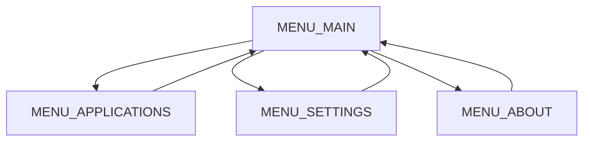
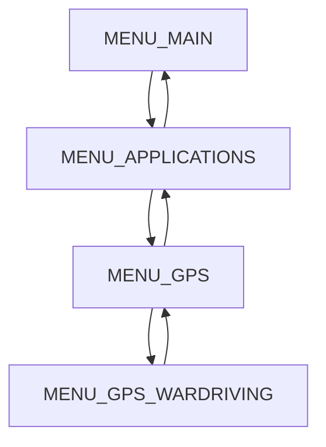

# Developer guide

You can build your own firmware using the [ESP-IDF](https://docs.espressif.com/projects/esp-idf/en/latest/esp32/get-started/index.html) framework or [Arduino](https://www.arduino.cc/en/software). However, we will focus on the ESP-IDF framework in this guide.

## Table of contents

- [Prerequisites](#prerequisites)
- [Development setup](#development-setup)
  - [Building the firmware](#building-the-firmware)
  - [Flashing the firmware](#flashing-the-firmware)
  - [Monitoring the serial output](#monitoring-the-serial-output)
  - [Full build process](#full-build-process)
  - [Cleaning the project](#cleaning-the-project)
- [Create a release](#create-a-release)
- [Development process](#development-process)
  - [Add a new menu](#add-a-new-menu)
    - [Menus structure](#menus-structure)
    - [Steps to add a new menu](#steps-to-add-a-new-menu)

## Prerequisites

- [Minino](https://electroniccats.com/store/minino/)
- [ESP-IDF](https://docs.espressif.com/projects/esp-idf/en/latest/esp32/get-started/index.html) installed
- [Make](https://www.gnu.org/software/make/) installed
- [pre-commit](https://pre-commit.com/) installed (optional but recommended)

## Development setup

1. Clone this repository:

Using HTTPS:

```bash
git clone https://github.com/ElectronicCats/Minino.git
```

Using SSH:

```bash
git clone git@github.com:ElectronicCats/Minino.git
```

2. Change to the firmware directory:

```bash
cd Minino/examples/minino
```

3. Set the IDF_PATH environment variable:

```bash
get_idf
```

> **Note:** `get_idf` should be an alias you created if you followed the [ESP-IDF installation guide](https://docs.espressif.com/projects/esp-idf/en/latest/esp32/get-started/index.html).

4. Setup the project environment:

```bash
make setup
```

## Building the firmware

To build the firmware, run the following command:

```bash
make compile
```

### Flashing the firmware

1. Connect your Minino to your computer and identify the port it is connected to. For example, `/dev/ttyUSB0` or `/dev/ttyACM0` on Linux, `COM1` or `COM2` on Windows, or `/dev/cu.usbmodem14401` on macOS.

2. Set the PORT to an environment variable, for example:

```bash
export PORT=/dev/ttyUSB0
```

> Replace `/dev/ttyUSB0` with the port your Minino is connected to.

3. Flash the firmware:

```bash
make flash
```

### Monitoring the serial output

To monitor the serial output, run the following command:

```bash
make monitor
```

### Full build process

To do all the previous steps in one command, run:

```bash
make all
```

### Cleaning the project

If you you have dependencies issues or want to clean the project, run the following command:

```bash
make clean
```

## Create a release

To create a release, you need to update the firmware version in the `menuconfig`. To do this, run:

```bash
idf.py menuconfig
```

Navigate to `General project` -> `Firmware version` and update the version number.

Get the build files:

```bash
./get_build.sh
```

If you can't run the script, make sure it has the correct permissions:

```bash
chmod +x get_build.sh
```

> **Note:** On Windows, you can run the script using Git Bash.

The build files will be in the `build_files.zip` file. Now you can create a release on GitHub and attach the `build_files.zip` file.

## Development process

### Add a new menu

#### Menus structure

Menus are defined in `screen_module_menu_t` in the `screens_module.h` file. Most of them have a tree structure, you can go from one menu to another, and go back. For example in the `MENU_MAIN` menu, you can go to `MENU_APPLICATIONS`, `MENU_SETTINGS`, or `MENU_ABOUT` and go back to `MENU_MAIN`.



**Menus can only have two possible actions: go to another menu or go back.**

Let's say you want to add a new menu called `MENU_GPS_WARDRIVING` that will be a child of `MENU_GPS` wich is a child of `MENU_APPLICATIONS`.



#### Steps to add a new menu

1. The first step is to add an enum value in `screen_module_menu_t`, it can be anywhere, but it's recommended to place it near to it's parent to make it easier to find. In this case, we will add it after `MENU_GPS`.

```c
/**
 * @brief Enum of menus
 *
 * Used to navigate through the different menus
 *
 * Modify this menu also requires to modify the `menu_list`, `next_menu_table`,
 * `prev_menu_table` and `menu_items` arrays
 */
typedef enum {
  MENU_MAIN = 0,
  MENU_APPLICATIONS,
  MENU_SETTINGS,
  MENU_ABOUT,
  /* Applications */
  ...
  MENU_GPS,
  /* GPS applications */
  MENU_GPS_WARDRIVING,
  MENU_GPS_DATE_TIME,
  MENU_GPS_LOCATION,
  MENU_GPS_SPEED,
  MENU_GPS_HELP,
  ...
  /* Menu count */
  MENU_COUNT,
} screen_module_menu_t;
```

> **Note:** The `MENU_COUNT` is used to get the number of menus, it's important to keep it at the end of the enum because it's used to do some runtime checks.

2. Add `MENU_GPS_WARDRIVING` as a string in `menu_list`, this is to debug purposes.

```c
/**
 * @brief List of menus
 *
 * Used to get the menu name from the enum value
 * following the order of the `screen_module_menu_t` enum
 *
 * Usage: menu_list[screen_module_menu_t]
 */
const char* menu_list[] = {
  "MENU_MAIN",
  "MENU_APPLICATIONS",
  "MENU_SETTINGS",
  "MENU_ABOUT",
  ...
  "MENU_GPS",
  ...
  "MENU_GPS_WARDRIVING",  // Add this line
  "MENU_GPS_DATE_TIME",
  "MENU_GPS_LOCATION",
  "MENU_GPS_SPEED",
  "MENU_GPS_HELP",
  ...
};
```

3. Add the option to the gps items array.

```c
char* gps_items[] = {
    "Wardrive",  // Add this line
    "Date & Time",
    "Location",
    "Speed",
    "Help",
    NULL,
};
```

> **Note:** The `NULL` at the end is to indicate the end of the array. It's important to add it, otherwise, the program will have undefined behavior.

4. Define the next menus of `MENU_GPS`, to go to `MENU_GPS_WARDRIVING` in the `screen_module_menu_t` array. We decided to place it as the first child of `MENU_GPS`, this **must** be consistent with the order of `gps_items`.

```c
/**
 * @brief List of menus
 *
 * Used to get the next menu to display when the user selects an option
 * following the order of the `screen_module_menu_t` enum
 *
 * Usage: next_menu_table[screen_module_menu_t][selected_item]
 */
const int next_menu_table[][MAX_NUM_ITEMS] = {
    // MENU_MAIN
    {MENU_APPLICATIONS, MENU_SETTINGS, MENU_ABOUT},
    ...
    // MENU_GPS
    {MENU_GPS_WARDRIVING, MENU_GPS_DATE_TIME, MENU_GPS_LOCATION, MENU_GPS_SPEED,
     MENU_GPS_HELP},
    ...
};
```

In this case, the comments `// MENU_MAIN` and `// MENU_GPS` represent the parent menu, they *must* be in the same order as the `screen_module_menu_t` enum. The `next_menu_table` is a 2D array where the first index is the parent menu and the second index is the child menu. The order of the child menus must be the same as the order of the items in the `menu_items` array.

5. Define the next menu of `MENU_GPS_WARDRIVING`. In this case, it's an application that doesn't have any child menus, so pressing the select button should do nothing.

```c
const int next_menu_table[][MAX_NUM_ITEMS] = {
    ...
     // MENU_GPS_WARDRIVING
    {MENU_GPS_WARDRIVING},  // Add it as itself does nothing
    ...
};
```

6. Define the previous menu of `MENU_GPS_WARDRIVING` in the `prev_menu_table` array.

```c
/**
 * @brief List of menus
 *
 * Used to get the previous menu to display when the user returns to the
 * previous menu in `menu_screens_exit_submenu`. Add the previous menu
 * following the order of the `screen_module_menu_t` enum
 *
 * Usage: prev_menu_table[screen_module_menu_t]
 */
const int prev_menu_table[] = {
    // PREVIOUS_MENU,                // CURRENT_MENU
    /*****************************************************************/
    MENU_MAIN,                       // MENU_MAIN
    MENU_MAIN,                       // MENU_APPLICATIONS
    MENU_MAIN,                       // MENU_SETTINGS
    MENU_MAIN,                       // MENU_ABOUT
    ...
    MENU_GPS,                        // MENU_GPS_WARDRIVING  --> Add this line
    MENU_GPS,                        // MENU_GPS_DATE_TIME
    MENU_GPS,                        // MENU_GPS_LOCATION
    MENU_GPS,                        // MENU_GPS_SPEED
    MENU_GPS,                        // MENU_GPS_HELP
    ...
};
```

Again, the comments represent the parent menu, and they *must* be in the same order as the `screen_module_menu_t` enum. The `prev_menu_table` is a 1D array where the index is the child menu and the value is the parent menu.

7. Add the menu items to the `menu_items` array. For now, we will add an empty array, but you can add the items you want to display in the menu.

```c
/**
 * @brief List of menu items
 *
 * Used to get the menu items from the menu enum value
 * following the order of the `screen_module_menu_t` enum
 *
 * Usage: menu_items[screen_module_menu_t]
 */
char** menu_items[] = {
    main_items,                       // MENU_MAIN
    applications_items,               // MENU_APPLICATIONS
    settings_items,                   // MENU_SETTINGS
    about_items,                      // MENU_ABOUT
    ...
    gps_items,                        // MENU_GPS
    ...
    empty_items,                      // MENU_GPS_WARDRIVING
    gps_date_time_items,              // MENU_GPS_DATE_TIME
    gps_location_items,               // MENU_GPS_LOCATION
    gps_speed_items,                  // MENU_GPS_SPEED
    gps_help,                         // MENU_GPS_HELP
    ...
};
```

And that's it! You should be able to navigate to the new menu. Test it and review this guide again in case you missed something.